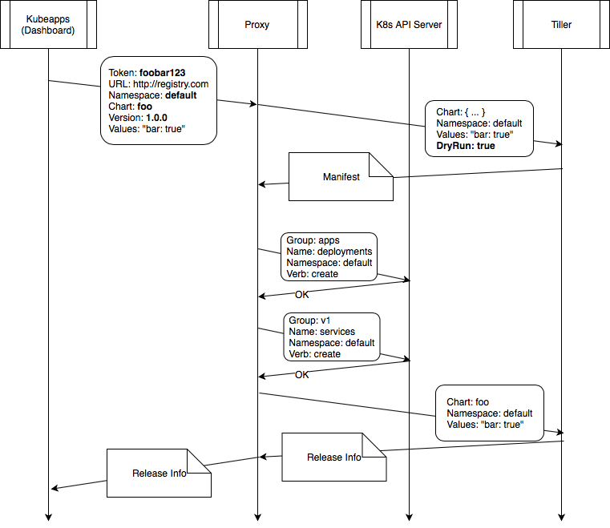

# Tiller Proxy

该代理是Kubeapps Plus的一项服务, 该服务将仪表板与Tiller连接起来。 该代理的目标是为经过身份验证的用户提供安全的代理, 以在不同名称空间中部署, 升级和删除图表。

该工具的部分逻辑已从[helm-CRD](https://github.com/bitnami-labs/helm-crd)中提取。 该工具已在Kubeapps Plus中弃用, 以避免必须在两个不同的地方(Tiller和CRD对象)同步发布的状态。

客户端应该提供标头`Authorization: Bearer TOKEN`作为令牌, Kubernetes API令牌才能执行任何操作。

# 配置

可以使用以下标志配置此代理: 

```
      --debug                           启用详细输出
      --disable-auth                    禁用授权检查
      --home string                     您的helm配置的位置。 覆盖$ HELM_HOME(默认为`/root/.helm`)
      --host string                     Tiller地址。 覆盖$HELM_HOST
      --kube-context string             要使用的kubeconfig上下文的名称
      --list-max int                    要获取的最大发行数量(默认256)
      --tiller-connection-timeout int   持续时间(以秒为单位)Helm将等待建立与分till的连接(默认为300)持续时间(以秒为单位)Helm将等待建立与分till的连接(默认为300)
      --tiller-namespace string         Tiller的名称空间(默认为“kube-system”)
      --tls                             为请求启用TLS
      --tls-ca-cert string              TLS CA证书文件的路径(默认为“/ca.crt”)
      --tls-cert string                 TLS证书文件的路径(默认为“/tls.crt”)
      --tls-key string                  TLS密钥文件的路径(默认为“/tls.key”)
      --tls-verify                      启用TLS进行请求并验证远程
```

# 路径

该代理提供6种不同的路由: 

  - `GET` `/v1/releases`: 列出耕种机的所有版本
  - `GET` `/v1/namespaces/{namespace}/releases`: 列出名称空间中的所有版本
  - `POST` `/v1/namespaces/{namespace}/releases`: 创建一个新版本
  - `GET` `/v1/namespaces/{namespace}/releases/{release}`: 获取发布信息
  - `PUT` `/v1/namespaces/{namespace}/releases/{release}`: 更新发布信息
  - `DELETE` `/v1/namespaces/{namespace}/releases/{release}`: 删除发行版

# 启用授权

默认情况下, 将启用任何请求的授权(可以使用标志--disable-auth禁用该请求)。 如果启用, 则客户端应具有以下权限: 

  - 在特定版本上执行HTTP GET时, “读取”对版本中所有版本资源的访问权限。
  - 执行HTTP POST时, “创建”对版本中所有版本资源的访问权限。
  - 执行HTTP PUT升级发行版时, 对所有发行版资源具有“创建”, “更新”和“删除”权限。
  - 执行HTTP PUT时, 对所有发布资源具有“删除”权限。

请注意, 用户只需要有效的令牌即可列出发行版。

目前, 唯一支持的身份验证方法是使用承载令牌。

# 工作流程

每个请求应至少包含: 

  -必需的操作: “获取”, “创建”, “升级”或“删除”。
  -图表存储库的网址。
  -图表存储库中图表的ID。
  -要使用的版本和值。

有了这些信息, 代理将解析应用程序的完整清单。 然后, 它将收集清单中包含的不同API组, 以验证由承载令牌标识的用户可以执行请求的操作。

这是Kubeapps Plus(仪表板), 代理, Tiller和K8s API之间的通信示例图, 用于部署由“ Deployment”和“ Service”组成的应用程序“ foo”: 


