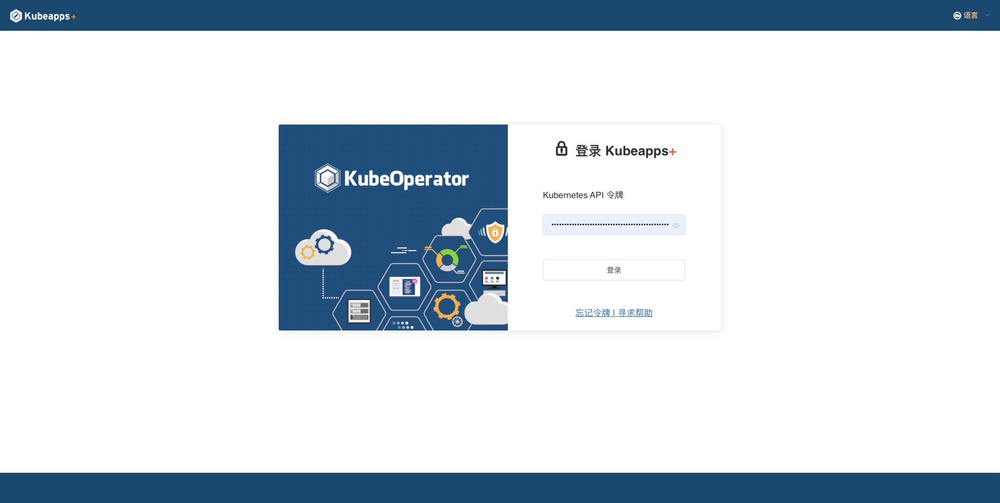
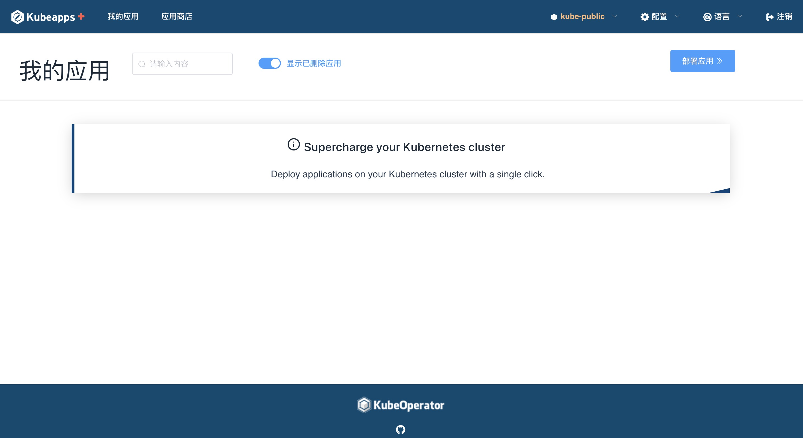

# KubeApps Plus 使用指南

本指南将引导您完成为集群部署 KubeApps Plus 并安装示例应用程序的过程。

KubeApps Plus 假设您的 Kubernetes 集群(v1.8 +), 安装在集群中的 [`Helm`](https://helm.sh/)(2.14.0+) 和 [`kubectl`](https://kubernetes.io/docs/tasks/tools/install-kubectl/)已安装并配置为与 Kubernetes 集群通信。 

KubeApps Plus 已通过 Azure Kubernetes 服务(AKS), Google Kubernetes 引擎(GKE), `minikube`和 用于桌面 Kubernetes 的 Docker 进行了测试。 KubeApps Plus 可在启用 RBAC 的群集上运行, 建议使用此配置以实现更安全的安装。

> 在GKE上, 您必须是`Owner`或具有`Container Engine Admin`角色才能安装 KubeApps Plus。

## Step 1: 安装 KubeApps Plus

使用 Helm 图表安装最新版本的 KubeApps Plus: 

```bash
git clone https://github.com/KubeOperator/kubeapps-plus.git
cd kubeapps-plus
helm install --name kubeapps-plus --namespace kubeapps-plus ./chart
```

有关安装, 配置和升级 KubeApps Plus 的详细信息, 请点击 [KubeApps Plus 安装指南](../../chart/README.md)。

上面的命令会将 KubeApps Plus 部署到集群中的 `kubeapps-plus` 名称空间中。 执行可能需要几分钟。 部署完成并且 KubeApps Plus 容器运行后, 继续执行步骤2。

## Step 2: 创建一个 Kubernetes API 令牌

访问仪表盘需要 Kubernetes API 令牌才能通过 Kubernetes API 服务器进行身份验证。

```bash
kubectl create serviceaccount kubeapps-operator
kubectl create clusterrolebinding kubeapps-operator --clusterrole=cluster-admin --serviceaccount=default:kubeapps-operator
```

> **注意** 不建议为 KubeApps Plus 生产用途创建 `cluster-admin` 用户。

获取令牌:

### On Linux/macOS:

```bash
kubectl get secret $(kubectl get serviceaccount kubeapps-operator -o jsonpath='{range .secrets[*]}{.name}{"\n"}{end}' | grep kubeapps-operator-token) -o jsonpath='{.data.token}' -o go-template='{{.data.token | base64decode}}' && echo
```

### On Windows:

创建一个名为 `GetDashToken.cmd` 的文件, 其中包含以下几行: 

```bat
@ECHO OFF
REM Get the Service Account
kubectl get serviceaccount kubeapps-operator -o jsonpath={.secrets[].name} > s.txt
SET/p ks=<s.txt
DEL s.txt

REM Get the Base64 encoded token
kubectl get secret %ks% -o jsonpath={.data.token} > b64.txt

REM Decode The Token
DEL token.txt
certutil -decode b64.txt token.txt
```

打开命令提示符并运行 `GetDashToken.cmd` 您的令牌可以在 `token.txt` 文件中找到。

## Step 3: 启动 KubeApps Plus 仪表板

安装 KubeApps Plus 后, 请运行以下命令从系统安全地访问 KubeApps Plus 仪表板: 

```bash
export POD_NAME=$(kubectl get pods -n kubeapps -l "app=kubeapps,release=kubeapps" -o jsonpath="{.items[0].metadata.name}")
echo "Visit http://127.0.0.1:8080 in your browser to access the KubeApps Plus Dashboard"
kubectl port-forward -n kubeapps $POD_NAME 8080:8080
```

这将启动 HTTP 代理, 以安全地访问 KubeApps Plus 仪表板。 在您喜欢的网络浏览器中访问 `http://127.0.0.1:8080/` 以打开仪表板。 这是您应该看到的: 



粘贴上一步中生成的令牌以认证和访问 Kubernetes 的 KubeApps Plus 仪表板。



## Step 4: 部署 WordPress

一旦 KubeApps Plus 仪表板启动并运行, 就可以开始将应用程序部署到群集中。

- 使用仪表板中的 “目录” 页面从任何已配置的Helm图表存储库中的图表列表中选择一个应用程序。 本示例假定您要部署 WordPress。

  

- 单击 “使用 Helm 部署”按钮。

  

- 系统将提示您输入应用程序的发行名称和值。

  

- 点击“提交”按钮。 该应用程序将被部署。 您将能够直接从浏览器跟踪新的 Kubernetes 部署。

  

要获取 WordPress 用户名和密码, 请参考部署页面的 “注释” 部分, 其中包含您需要运行以获取部署凭据的命令。

您也可以使用显示的URL直接访问应用程序。 
请注意, 根据您选择的云提供商的不同, 访问URL可能需要一些时间才能用于应用程序, 并且该服务将保持“待处理”状态, 直到分配了URL。 
如果使用 Minikube, 则需要在终端中运行 `minikube tunnel`, 以便将IP地址分配给您的应用程序。


## 下一步

通过以下链接了解有关 KubeApps Plus 的更多信息: 

- [KubeApps Plus安装说明](../../chart/README.md)
- [KubeApps Plus仪表板](dashboard/README.md)
- [KubeApps Plus架构说明](../architecture/overview.md)
